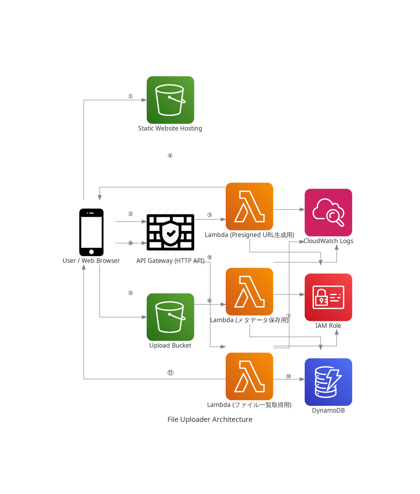

# サーバーレス ファイルアップローダー

## 概要 (Overview)

このプロジェクトは、AWSのサーバーレスアーキテクチャとTerraformによるInfrastructure as Code (IaC) の実践的なスキル習得を目的として作成した、Webベースのファイルアップローダーです!

ユーザーはブラウザからファイルを安全にアップロードでき、アップロードされたファイルの情報は一覧で確認できます。バックエンドはAPI GatewayとLambda、DynamoDB、S3で構成され、フロントエンドとの通信から非同期のイベント処理まで、モダンなサーバーレスのベストプラクティスを盛り込んでいます。

## アーキテクチャ図 (Architecture Diagram)

## シーケンス (Sequence)

このアプリケーションの主要な機能は、以下の流れで実現されています。

### ファイルアップロード処理フロー

1.  **[サイトアクセス]** ユーザーがブラウザで **S3 (静的ウェブサイト)** にアクセスし、Webページを表示します。
2.  **[署名付きURLリクエスト]** ユーザーがファイルを選択後、ブラウザ上のJavaScriptが **API Gateway** の `/generate-presigned-url` エンドポイントに「署名付きURL」をリクエストします (POST)。
3.  **[Lambda実行]** **API Gateway** はリクエストを受け、**Lambda (署名付きURL生成用)** をトリガーします。
4.  **[署名付きURL応答]** **Lambda** は、S3への一時的な書き込み許可を持つ署名付きURLを生成し、ブラウザに返します。
5.  **[S3へ直接アップロード]** ブラウザのJavaScriptは、受け取った署名付きURLを使い、ファイル本体を **S3 (アップロード用バケット)** に直接アップロードします (PUT)。
6.  **[メタデータ保存トリガー]** ファイルがS3に作成されると、S3イベント通知が **Lambda (メタデータ保存用)** をトリガーします。
7.  **[メタデータ保存]** **Lambda** は、ファイル情報を **DynamoDB** テーブルに書き込みます。

### ファイル一覧表示処理フロー

1.  **[ファイル一覧リクエスト]** Webページ上のJavaScriptが **API Gateway** の `/files` エンドポイントにファイル一覧をリクエストします (GET)。
2.  **[Lambda実行]** **API Gateway** はリクエストを受け、**Lambda (ファイル一覧取得用)** をトリガーします。
3.  **[データ取得]** **Lambda** は、**DynamoDB** テーブルをスキャンして全ファイル情報を取得します。
4.  **[ファイル一覧応答]** **Lambda** は、取得したファイルリストをブラウザに返します。

## 使用技術一覧 (Tech Stack)

### IaC (Infrastructure as Code)
- Terraform

### AWS (Backend)
- **API Gateway:** HTTP API
- **Lambda:** Python 3.11 Runtime
- **S3:** ファイルストレージ, (静的ウェブサイトホスティング)
- **DynamoDB:** メタデータストレージ
- **IAM:** 各種権限管理 (ロール, ポリシー)
- **CloudWatch:** ログ監視

### Programming Language
- Python 3
  - Boto3 (AWS SDK)

### Frontend
- HTML
- CSS (Pico.css フレームワーク利用)
- JavaScript (Fetch API)

## 機能一覧 (Features)

- **ファイルアップロード機能:**
  - Webブラウザからファイルを選択し、アップロードできます。
  - バックエンドでS3署名付きURLを動的に生成し、安全かつ効率的にS3へ直接ファイルをアップロードする仕組みを実装しています。
- **メタデータ自動保存機能:**
  - S3へのファイルアップロードをトリガーとして、Lambda関数が自動実行されます。
  - ファイル名、S3の保存先パス、ファイルサイズ、更新日時などのメタデータがDynamoDBに自動的に記録されます。
- **ファイル一覧表示機能:**
  - アップロードされたファイルの一覧をAPI経由でDynamoDBから取得し、Webページ上に動的に表示します。

## 使い方・動かし方 (Usage / How to Deploy)

## 工夫した点・苦労した点 (Highlights / Challenges)